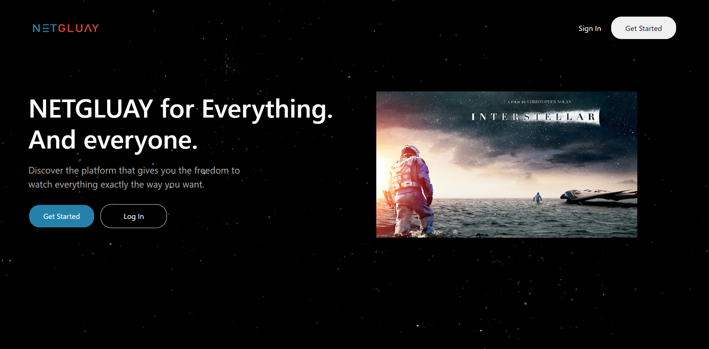
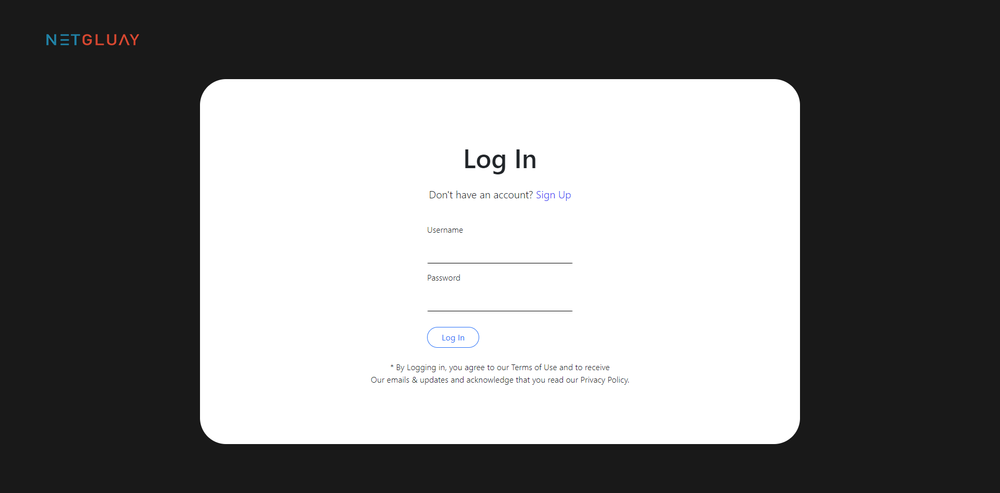
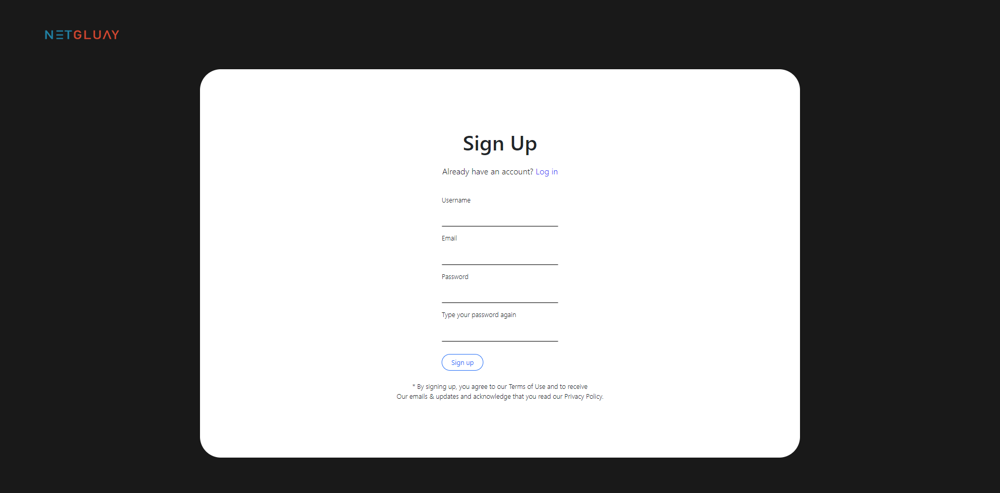
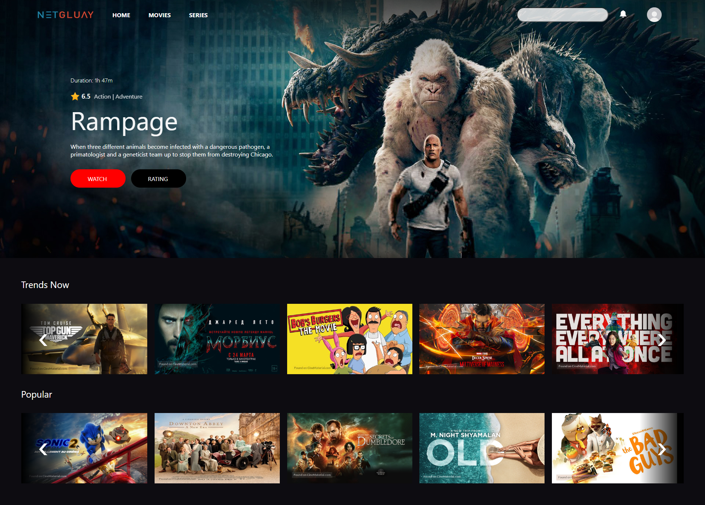
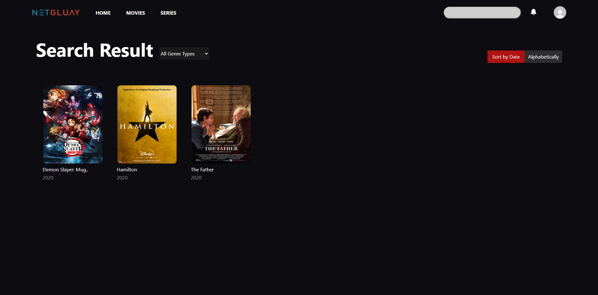
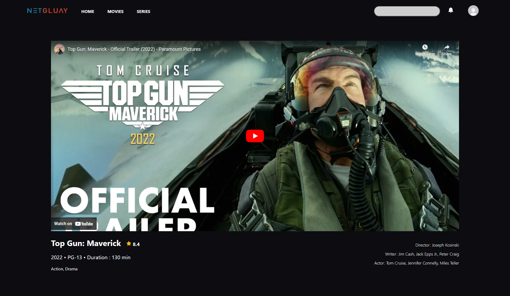

# netgluay_v2_backend
A movies platform website built using Node.js and the EJS template engine, with a relational database to store and retrieve information. The website is inspired by Netflix in its functionality, but does not use any frameworks. Data about movies is gathered through API calls and trailers are embedded via iframe links from YouTube. 

to run the service you will need to install all of the package include in package.json
```
npm install
```

After install all the package needed, you will need to create new SQL Database, Import the Given SQL Queries and change the credentials of the DB in app.js,
(he current DB does not work anymore since I didn't manage to extend the session of it)
```
var connection = mysql.createConnection({
    host: "localhost",
    user: "Username",
    password: "Password",
    database: "Database Name"
});
```

To run the website type :

```
npm start
```
or 
```
node app.js
```

Snapshot of the website :








